# 🏢 Corporate Dynamics Simulation Engine

> **AI-augmented development** of an enterprise-grade corporate adventure game with sophisticated stakeholder relationship modeling, multi-provider AI integration, and real-time cost optimization.

## 🤖 AI Development Team


## 🚀 Tech Stack


## 🎯 What Was Built

**Complex AI-powered corporate simulation** that demonstrates enterprise architecture patterns through an interactive business adventure game. Players navigate corporate politics while the system models multi-dimensional stakeholder relationships with realistic cascade effects.

### ⚡ The Sophisticated Stuff

- **🧠 Multi-Provider AI Orchestration**: Intelligent routing between OpenAI, Anthropic, and Gemini with automatic fallbacks
- **💰 Smart Cost Optimization**: Semantic caching + context compression designed to achieve significant cost reduction
- **🔄 Enterprise Resilience**: Circuit breakers, health monitoring, and graceful degradation
- **📊 Real-time Analytics**: Comprehensive metrics, budget tracking, and performance monitoring
- **🎭 Complex Business Logic**: Multi-dimensional stakeholder relationships with influence networks and behavioral patterns
- **⚙️ State Management**: Complete audit trail with rollback capabilities for enterprise compliance

### 🎮 The Experience

Navigate corporate scenarios where your decisions create ripple effects through complex stakeholder networks. Watch relationships evolve, alliances form, and corporate cultures shift based on your choices. All powered by AI that generates contextually appropriate content while optimizing for cost and quality.

## 📸 Screenshots

### Scenario Selection

*Choose from 9 sophisticated corporate scenarios*

### AI-Generated Stakeholder Dialogue  

*Dynamic AI responses that feel authentically corporate*

## 🏃‍♂️ Quick Start

```bash
# 1. Clone and install
git clone https://github.com/your-username/corporate-simulation-engine
cd corporate-simulation-engine
pip install -r requirements.txt

# 2. Add your API key (one line!)
echo "GEMINI_API_KEY=your_actual_api_key_here" > .env

# 3. Run immediately
python corporate_simulator.py
```

**That's it!** No virtual environments, no complex setup, no shell configuration.

Get your free Gemini API key at: https://aistudio.google.com/app/apikey

## 🎪 The Vibe

This project showcases **AI-orchestrated enterprise development** - demonstrating how human creativity can conduct AI development teams to build sophisticated systems that traditionally require months of enterprise development.

**The AI Development Process:**
1. **🏗️ Architecture Design** (Claude Opus 4): System design, enterprise patterns, component relationships
2. **🧠 Complex Logic** (Claude Sonnet 3.7): AI orchestration, cost optimization, relationship algorithms  
3. **⚡ Implementation** (SWE-1): Code generation, testing, integration work
4. **🔄 Iteration** (Windsurf IDE): Real-time collaboration, debugging, refinement

## 🌟 Key Features

### 🤖 AI Integration Excellence
- **Semantic Caching**: Vector-based similarity matching for improved efficiency
- **Provider Health Monitoring**: Real-time health assessment with automatic routing
- **Budget Management**: Live cost tracking with configurable alerts and emergency brakes
- **Quality Assurance**: Multi-stage content validation for corporate authenticity

### 🎯 Enterprise Architecture Patterns
- **State Management**: Complete audit trail with state reconstruction capabilities
- **Circuit Breaker**: Fault tolerance with automatic recovery mechanisms  
- **Health Monitoring**: Real-time provider status and performance tracking
- **Observability**: Comprehensive metrics, tracing, and health monitoring

### 🎭 Sophisticated Business Logic
- **Multi-dimensional Relationships**: Trust, respect, influence networks with cascade effects
- **Behavioral Pattern Recognition**: Stakeholders adapt based on player behavior history
- **Corporate Culture Modeling**: Dynamic culture shifts based on decisions and actions
- **Realistic Scenario Generation**: AI-powered content that feels authentically corporate

## 📊 System Architecture

```mermaid
graph LR
    A[CLI Layer<br/>• Rich Interface<br/>• Live Metrics<br/>• Health Status] 
    B[AI Orchestrator<br/>• Multi-Provider<br/>• Cost Optimizer<br/>• Semantic Cache]
    C[State Management<br/>• Relationship Matrix<br/>• Audit Trail<br/>• Game State]
    
    A <--> B
    B <--> C
```



The system intelligently routes requests through multiple AI providers, applies context compression and semantic caching, validates content quality, and maintains complete audit trails - all while keeping costs optimized and providing enterprise-grade reliability.

## 🔧 Configuration

Works instantly with free-tier Gemini API. 

Optional: Add multiple providers for enhanced performance:

```bash
# Optional: Add your API keys for better performance
OPENAI_API_KEY=sk-...
ANTHROPIC_API_KEY=sk-...  
GEMINI_API_KEY=key-...

# Cost management
MONTHLY_BUDGET=10.0
ENABLE_CACHING=true
AGGRESSIVE_COMPRESSION=false
```

## 🧪 Corporate Scenarios

Navigate through 9 sophisticated business scenarios that test your leadership and decision-making skills:

### 🎯 **Core Crisis Management**
- **☕ Coffee Machine Crisis**: Navigate office politics when the coffee machine breaks
- **🤖 AI Hype Cycle**: Balance innovation pressure with practical concerns
- **🏠 Return to Office**: Manage stakeholder tensions around remote work policies
- **🔒 Security vs Speed**: Handle the eternal security-versus-agility tradeoff

### 🚀 **Advanced Leadership Challenges**  
- **💸 Technical Debt Reckoning**: When shortcuts from years past come due
- **🔥 Burnout Crisis**: Handle team exhaustion while maintaining delivery
- **🛡️ Legacy System Guardian**: Navigate modernization vs stability tensions
- **🔗 Vendor Lock-in Dilemma**: Balance convenience with strategic flexibility
- **🤝 Cross-Functional Conflict**: Resolve department territorial disputes

Each scenario features multiple branching paths, realistic stakeholder reactions, and consequences that ripple through future interactions.

## 🤝 Disclaimer

This repository is a demo and exploration of creating an enterprise-grade corporate simulation through AI-orchestrated development. It's not a template for mass adoption or open-source collaboration—just a public display of what happens when you let vibes (and AI) guide your coding.

**Not accepting contributions or issues.** If you vibe with it, fork away and make it your own!

## 📜 License

MIT License. See [LICENSE](LICENSE).

---
